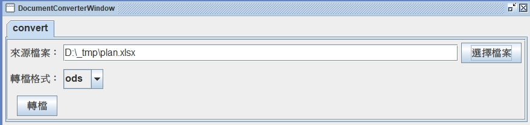
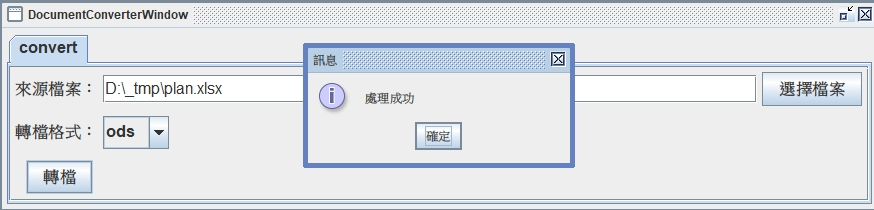
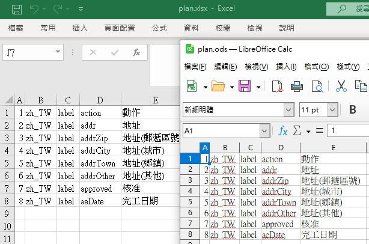

# 開放文件轉換系統

## 公共程式描述

本專案為當使用者需要將傳統Word、Excel或PDF進行開放文件格式轉換時，可透過本系統整合開放原始碼的 LibreOffice 文件轉換工具進行處理，解決了常見文件格式間直接轉換的問題，並可以進一步整合到定時整批排程處理的自動化處理作業中。 本系統能夠高效地將 .docx、.xlsx、.xls、.pdf 等文件格式轉換為 HTML、PDF、DOCX、XLSX、PPTX 等多種開放文件目標格式，有效提升文件轉換效率與文件有效利用的兼容性。

## 內含功能

- Office文件、PDF文件及ODF文件轉換。
- 各類文件轉換範例
- 批次排程自動化處理應用

## 使用技術

- Spring Boot 
- LibreOffice 
- jodconverter 
- Java

## 使用之弱點掃描工具

Fortify SCA

## 授權方式

Apache License 2.0

## 使用案例

行政院公共工程委員會
「公共工程雲端系統資訊服務案」之公共工程雲端系統

## 安裝指南

請確保您的環境中安裝有 Java 17 、 Maven 3 、LibreOffice 24 以上版本，

```bat
# 執行步驟
> git clone https://github.com/TsubasaRush/open-file-conversion-system.git
> cd open-file-conversion-system
> mvn clean package
> java -jar target/open-file-conversion-system-0.0.1-SNAPSHOT.jar
```
## 結果展示

> 可以透過介面選擇來源檔案，設定轉換格式<br/>


> 執行轉檔<br/>


> 轉檔結果<br/>



